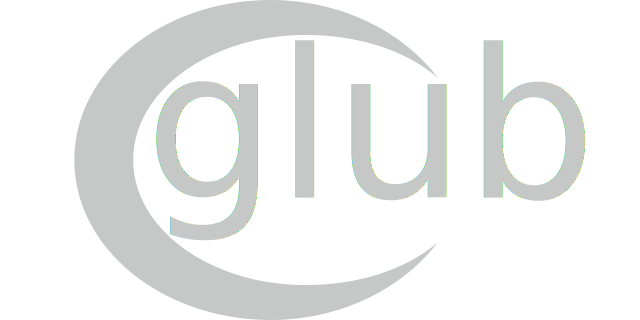

# openGL's Ultimate Boilerplate
Easy to use CMake boilerplate for developing OpenGL programs in C++

## Features

- [OpenGL](https://www.khronos.org/opengl/wiki/Getting_Started)
- [Xlib](https://www.x.org/releases/X11R7.7/doc/libX11/libX11/libX11.html)
- [GLEW](http://glew.sourceforge.net/)
- [GLAD](https://github.com/Dav1dde/glad)
- [GLFW](https://www.glfw.org/)
- [IMGUI](https://github.com/ocornut/imgui)
- [SDL](https://www.libsdl.org/)
- [GLM](https://glm.g-truc.net/0.9.9/index.html)
- [MathFu](http://google.github.io/mathfu/)
- [STB](https://github.com/nothings/stb)
- [Freetype](https://www.freetype.org/)

## Supported platforms

- Linux

# Setup
1. Create git repository for your project
2. [Generate](https://drgy.github.io/glub/) `CMakeLists.txt`, `main.cpp` and place them into your project
3. Files that should be compiled must be in `src` directory (including `main.cpp`)
4. Place resources that are required by your project (images, fonts, shaders...) into `res` directory

## Bash
1. `mkdir build build/debug build/release`
2. `cd build/debug`
3. `cmake -DCMAKE_BUILD_TYPE=Debug ../../`
4. `cd ../release`
5. `cmake -DCMAKE_BUILD_TYPE=Release ../../`

To build project navigate to `build/debug` or `build/release` and run `cmake --build .`

## CLion
1. File > Settings
2. Build, Execution, Deployment > CMake
3. Create profile for Debug (Generation path: build/debug) and Release (Generation path: build/release)
4. Run
